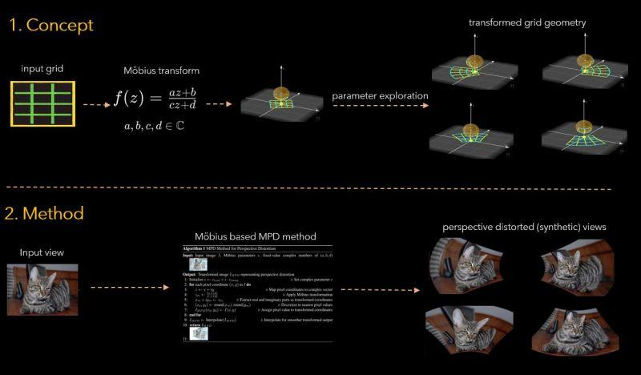

# MPD
**Möbius Transform for Mitigating Perspective Distortions in Representation Learning (ECCV2024)**

_Chhipa, P.C., Chippa, M.S., De, K., Saini, R., Liwicki, M., Shah, M.: Möbius transform for mitigating perspective distortions in representation learning. European Conference on Computer Vision. (ECCV 2024)_




1. Pretrained models - https://huggingface.co/prakashchhipa/MPD_SSL
2. ImageNet-PD benchmark dataset - https://huggingface.co/datasets/prakashchhipa/ImageNet-PD
3. Two minutes summary on MPD - https://prakashchhipa.github.io/projects/mpd/


## Commands to Train Models

### 1. Supervised Training with ResNet50 and Mobius Probability 0.2
Train a ResNet50 model under a supervised setting with Mobius transformations applied with a probability of 0.2:
```bash
torchrun --nproc_per_node=2 train_supervised.py --model resnet50 --apply-mobius --forward-mobius --mobius-prob 0.2 --name supervised_mpd_rn50
```

### 2. SimCLR Pretraining with Mobius
Pretrain ResNet50 using the SimCLR framework with Mobius transformations:
```bash
python train_simclr.py --config configs/imagenet_train_epochs100_bs512.yaml
```

### 3. SimCLR Pretraining with Mobius and Padded Background
Pretrain ResNet50 with SimCLR, applying Mobius transformations and controlling the background with the `mobius_background` input:
```bash
python train_simclr.py --config configs/imagenet_train_epochs100_bs512.yaml
```

### 4. Finetune Downstream Task for SimCLR-Trained ResNet50
Fine-tune a ResNet50 model pretrained with SimCLR for a downstream task using Mobius transformations:
```bash
torchrun --nproc_per_node=5 train_downstream_task_from_ssl.py --model resnet50 --apply-mobius --apply-BGI --name downstream_simclr_rn50 --forward-mobius --mobius-prob 0.2 --ssl-checkpoint <checkpoint URL>
```

### 5. DINO Self-Supervised Pretraining
Pretrain a Vision Transformer (ViT) using DINO with Mobius transformations:
```bash
python -m torch.distributed.launch --nproc_per_node=8 main_dino_mobius.py --mobius_prob 0.8 --arch vit_small --data_path /path/to/imagenet/train --output_dir /path/to/saving_dir
```

### 6. DINO Self-Supervised Pretraining with Padded Background
Pretrain a Vision Transformer (ViT) using DINO with Mobius transformations and a padded background:
```bash
python -m torch.distributed.launch --nproc_per_node=8 main_dino_mobius_bgi.py --mobius_prob 0.8 --arch vit_small --data_path /path/to/imagenet/train --output_dir /path/to/saving_dir
```

## In-progress Work
The source code for additional computer vision applications will be released later.

## GitHub repository credits
[simclr-pytorch](https://github.com/AndrewAtanov/simclr-pytorch)
[pytorch-classfication](https://github.com/pytorch/vision/tree/main/references/classification)


